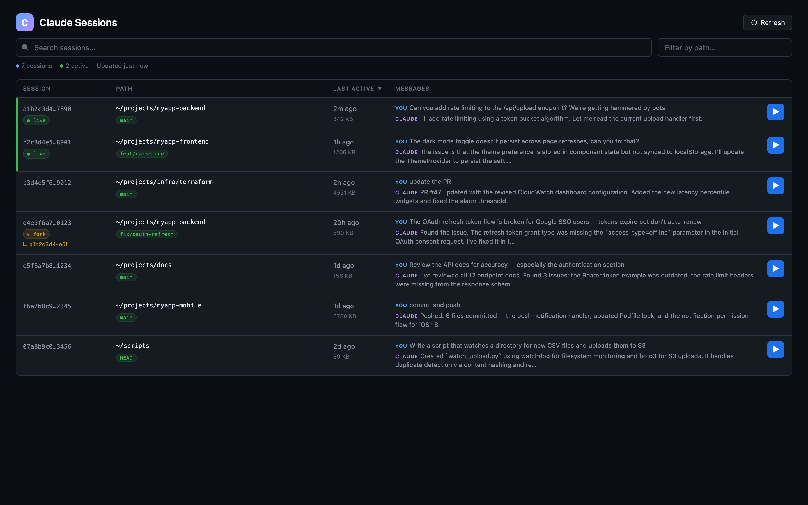

# Claude Session Dashboard

A localhost web dashboard for browsing, searching, and resuming [Claude Code](https://docs.anthropic.com/en/docs/claude-code) sessions.

If you use Claude Code across many projects, worktrees, and branches, you've probably lost track of sessions. This dashboard scans your local `~/.claude/projects/` directory and presents all your sessions in a filterable, sortable table — with one-click resume.



## Features

- **Session table** with columns: Session ID, Path, Last Active, Messages
- **Expandable rows** — click any row to see a scrollable chat log of the last ~30 messages
- **Path filter** with autocomplete — type to filter sessions by project path
- **Full-text search** across session IDs, paths, branches, and message content
- **Sort by timestamp** (newest/oldest first)
- **Fork detection** — shows which sessions were forked from others
- **Live session indicators** — green badge for currently running sessions
- **One-click resume** — opens a new Ghostty window with `claude --resume <session-id>`
- **Auto-refresh** every 5 minutes + manual refresh
- **Single-turn filtering** — hides `--print` mode (automated/one-shot) sessions by default
- **Zero dependencies** — pure Python 3 stdlib, single file, no npm/pip install needed

## Requirements

- **macOS** (uses `launchd` for background service, Ghostty for terminal launch)
- **Python 3.9+** (ships with macOS)
- **[Claude Code](https://docs.anthropic.com/en/docs/claude-code)** installed and used (needs `~/.claude/projects/`)
- **[Ghostty](https://ghostty.org)** terminal (for the resume button)

## Install

```bash
git clone https://github.com/AkshatBaranwal/claude-session-dashboard.git
cd claude-session-dashboard
bash install.sh
```

This installs a `launchd` agent that:
- Starts the dashboard automatically on login
- Restarts it if it crashes
- Runs on port `7891` by default

Custom port:
```bash
bash install.sh 8080
```

Then open **http://127.0.0.1:7891** in your browser.

## Uninstall

```bash
bash uninstall.sh
```

## Manual usage

If you prefer not to use the background service:

```bash
python3 server.py                # default port 7891
python3 server.py --port 8080    # custom port
```

## How it works

1. **Scans** `~/.claude/projects/*/` for `.jsonl` session files
2. **Parses** the head and tail of each file to extract metadata (session ID, project path, git branch, last messages, fork info)
3. **Caches** parsed session data in memory with mtime-based invalidation
4. **Serves** a single-page dashboard on localhost with a REST API:
   - `GET /` — the dashboard HTML
   - `GET /api/sessions` — paginated, filterable, sortable session list
   - `GET /api/history/<session-id>` — last ~30 messages for a session
   - `POST /api/launch` — opens a Ghostty terminal with `claude --resume`

## Terminal support

The resume button currently launches **Ghostty**. To use a different terminal, edit the `do_POST` handler in `server.py` — look for the `ghostty` binary path and replace with your terminal's launch command.

## License

MIT
